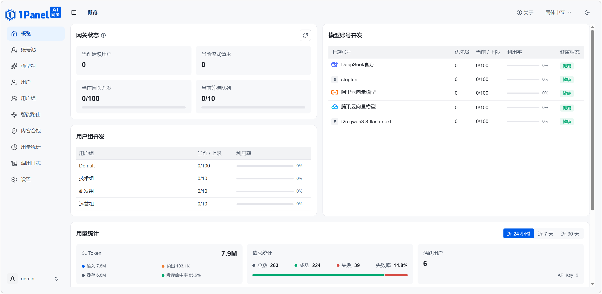
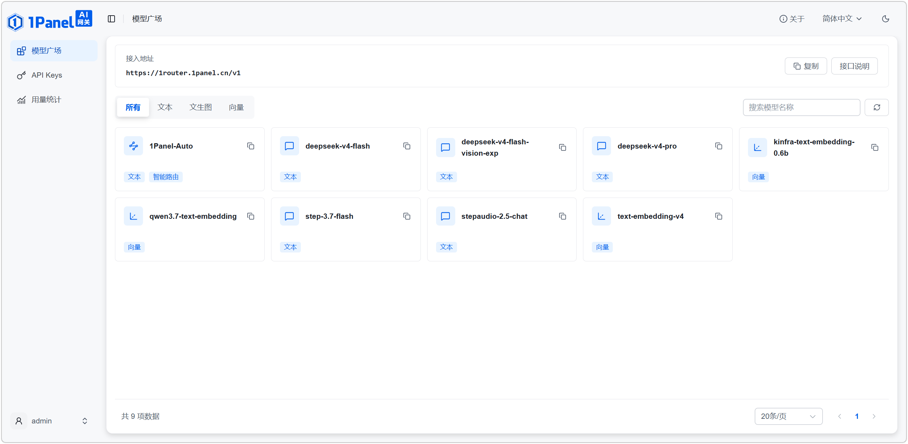
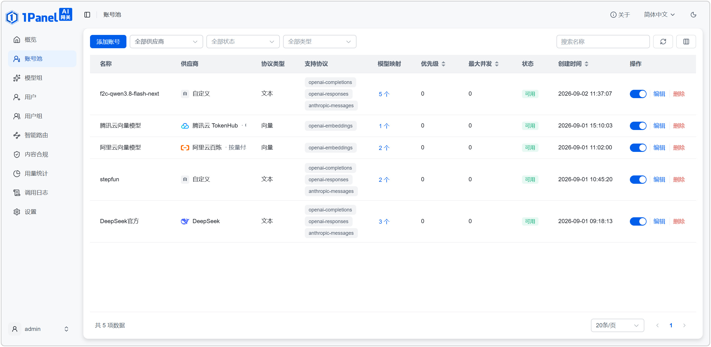
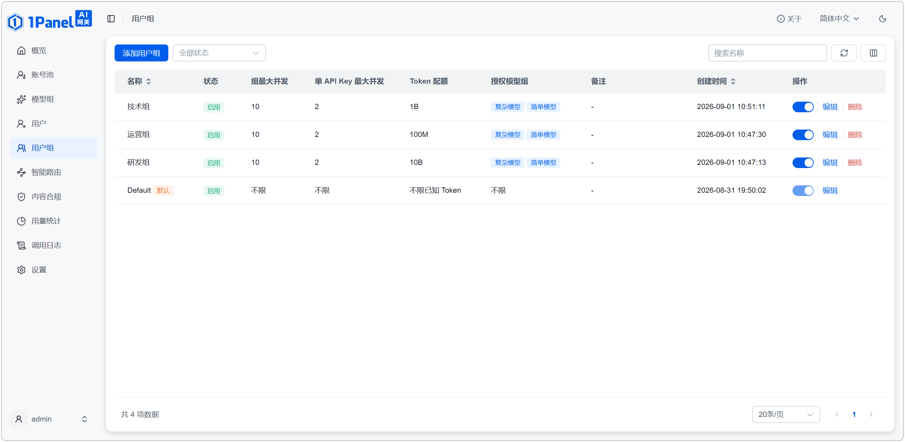
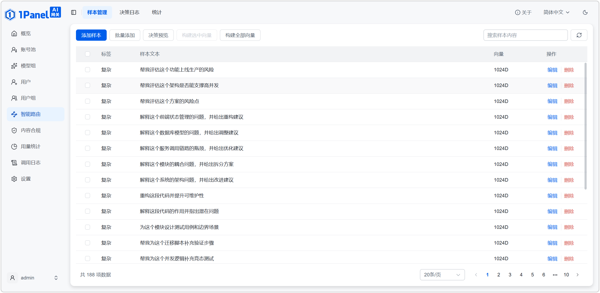
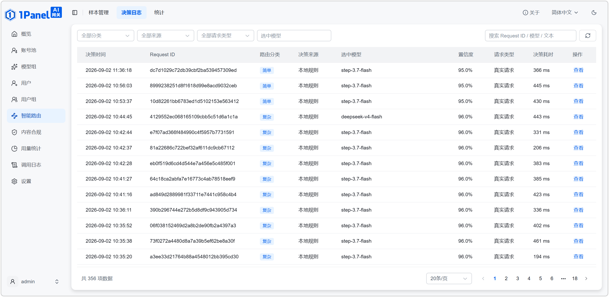
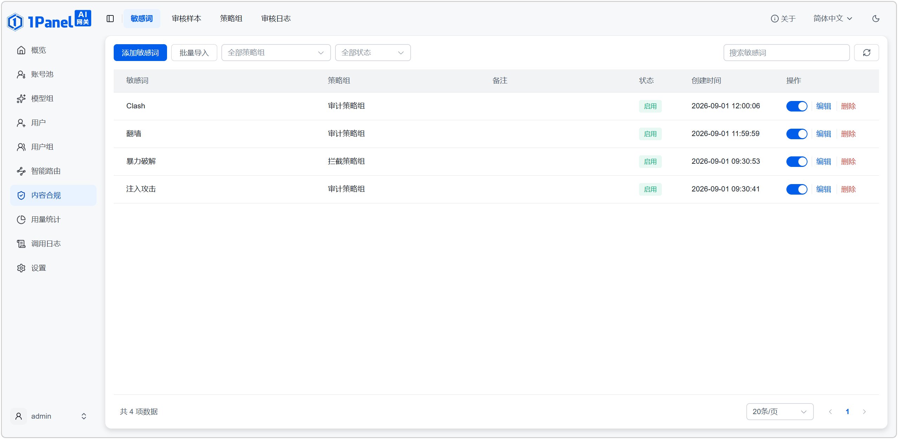
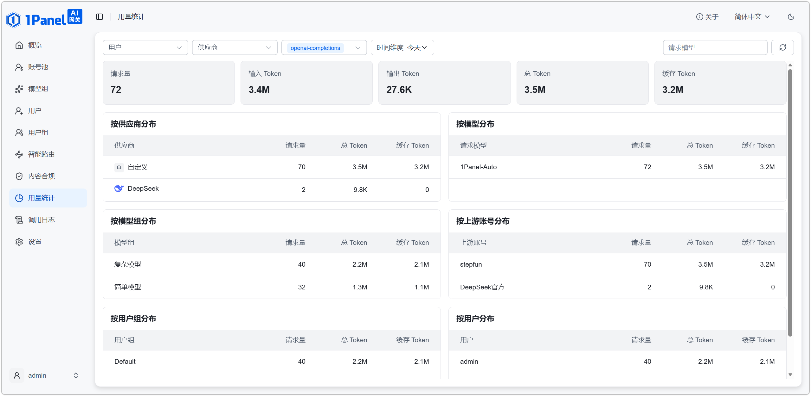

<p align="center">
  <a href="https://1panel.cn/ai-gateway.html"></a>
</p>

<p align="center">
  打造企业专属的 AI 统一接入与治理平台
</p>

<p align="center">
  
  <a href="https://github.com/1Panel-dev/1Panel-Gateway"></a>
</p>

---

## 什么是 1Panel AI 网关？

1Panel AI 网关是面向企业和团队的 AI 统一接入与治理平台，提供模型代理、智能路由、权限控制、内容合规和用量分析等能力，让 AI 应用更安全、稳定、经济地使用不同模型资源。

AI 应用只需配置统一的 Base URL 和 API Key，即可通过标准接口访问公有云 API、本地 vLLM 集群及其他模型服务。10 人及以下规模的团队可免费使用完整的 AI 网关治理能力。

## 核心能力

- **统一接入与模型代理**：集中接入不同供应商和本地模型，通过模型映射与账号池统一调度。
- **席位与权限管理**：按用户组、用户和 API Key 管理模型权限、并发限制与 Token 配额。
- **智能路由**：根据请求内容与预设规则，将任务分发至合适的模型组。
- **负载与并发控制**：结合账号优先级、实时负载和健康状态分配请求，降低单点依赖。
- **内容合规**：提供敏感词、语义审核和调用内容审计能力。
- **用量分析**：统计请求量、Token 消耗、缓存利用率和响应耗时，帮助团队分析成本与排查问题。

## 快速开始

### 通过 1Panel 应用商店部署

你也可以通过 [1Panel 应用商店](https://apps.fit2cloud.com/1panel) 快速部署。

### 使用 Docker 部署

```bash
docker run --pull always -d \
  --name 1panel-ai-gateway \
  --restart unless-stopped \
  -p 8080:8080 \
  -v /opt/ai-gateway:/opt/ai-gateway \
  1panel/ai-gateway
```

首次启动后，使用以下命令查看管理员临时密码：

```bash
docker logs 1panel-ai-gateway
```

通过 `http://<服务器 IP>:8080` 访问 1Panel AI 网关。首次登录后请立即修改临时密码。

> [!IMPORTANT]
> 建议仅在可信内网中直接开放 8080 端口；生产环境请配置 HTTPS 反向代理。

## 界面预览



<table>
  <tr>
    <td align="center"><br><sub>模型广场</sub></td>
    <td align="center"><br><sub>模型代理与账号池</sub></td>
  </tr>
  <tr>
    <td align="center"><br><sub>用户组与权限控制</sub></td>
    <td align="center"><br><sub>智能路由样本</sub></td>
  </tr>
  <tr>
    <td align="center"><br><sub>智能路由决策日志</sub></td>
    <td align="center"><br><sub>敏感词管理</sub></td>
  </tr>
  <tr>
    <td colspan="2" align="center"><br><sub>用量统计</sub></td>
  </tr>
</table>

## 获取帮助

> [!NOTE]
> 本仓库不开放 Issues 和 Discussions，请前往 [1Panel 主仓库](https://github.com/1Panel-dev/1Panel)反馈问题与建议。

- **官方网站** — [1Panel AI 网关](https://1panel.cn/ai-gateway.html)
- **使用文档** — [1Panel-Gateway](https://docs.fit2cloud.com/1Panel-Gateway)
- **社区论坛** — [1Panel 论坛](https://bbs.fit2cloud.com/c/1p/7)
- **问题反馈** — [1Panel Issues](https://github.com/1Panel-dev/1Panel/issues)
- **交流讨论** — [1Panel Discussions](https://github.com/1Panel-dev/1Panel/discussions)
